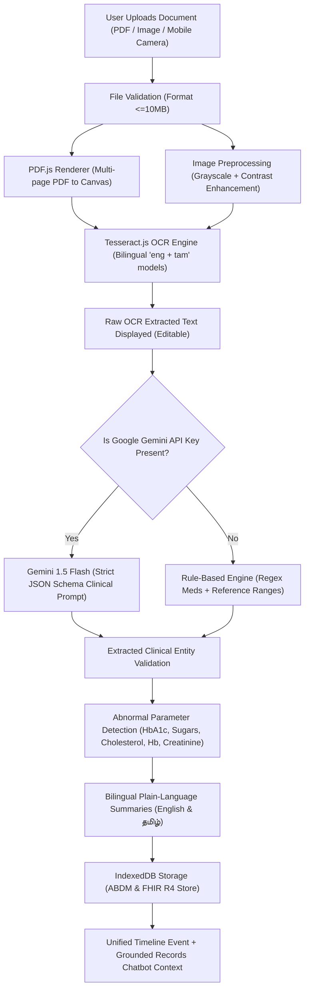
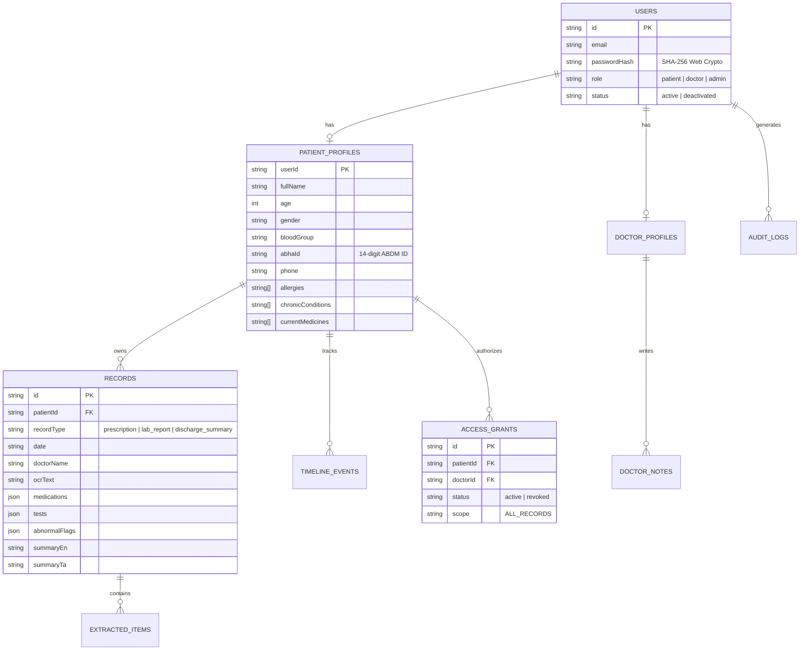

# Architecture & Technical Design: AI-Powered Personal Health Copilot

**Altrix Labs Hackathon Challenge Project**  
*Built for Individuals, Clinics & Doctors in English & தமிழ் (Tamil).*

---

## 1. System Overview

The **AI-Powered Personal Health Copilot** is an offline-first, client-side, zero-backend medical application architected for instant deployment to GitHub Pages. It enables:
1. **Unauthenticated Quick Scan**: Instant OCR on phone camera photos, images, and PDFs + bilingual plain-language breakdowns.
2. **Clinical Practice Portal**: Multi-patient dashboard with 14-digit ABHA search, doctor notes, and records upload on behalf of patients.
3. **Personal Health Timeline**: Chronological records with FHIR R4 standard export and a grounded AI chatbot.

---

## 2. End-to-End Clinical Processing Pipeline

---

## 3. ABDM & FHIR-Ready Data Model

The application uses browser **IndexedDB (via `idb`)** partitioned across 9 distinct stores:

---

## 4. HL7 FHIR R4 Mapping

When exporting via the **Export FHIR Bundle** feature, records are dynamically serialized into an HL7 FHIR R4 `Bundle` (`type: "document"`):

| Internal Concept | HL7 FHIR R4 Resource | Identifier / Mapping |
| :--- | :--- | :--- |
| Patient Profile | `Patient` | ABHA Identifier (`https://healthid.ndhm.gov.in`) |
| Lab Tests | `Observation` | ValueQuantity, ReferenceRange, Interpretation (H/L/N) |
| Prescribed Drugs | `MedicationStatement`| Dosage, timing instructions, clinical indication |
| Diagnosed Conditions | `Condition` | Active clinical status |
| Uploaded File/Scan | `DocumentReference` | Attachment metadata and MIME type |

---

## 5. Security & Privacy Guarantees

- **No Remote Server Leakage**: All OCR runs via WebAssembly in the client worker; all records persist locally in IndexedDB.
- **Client-Side Cryptography**: Passwords hashed using the standard Web Crypto API (`crypto.subtle.digest('SHA-256')`).
- **Grounded AI Guardrails**: Chatbot answers strictly from the patient's own records with clear emergency directives (108 / 112) for acute symptoms.
